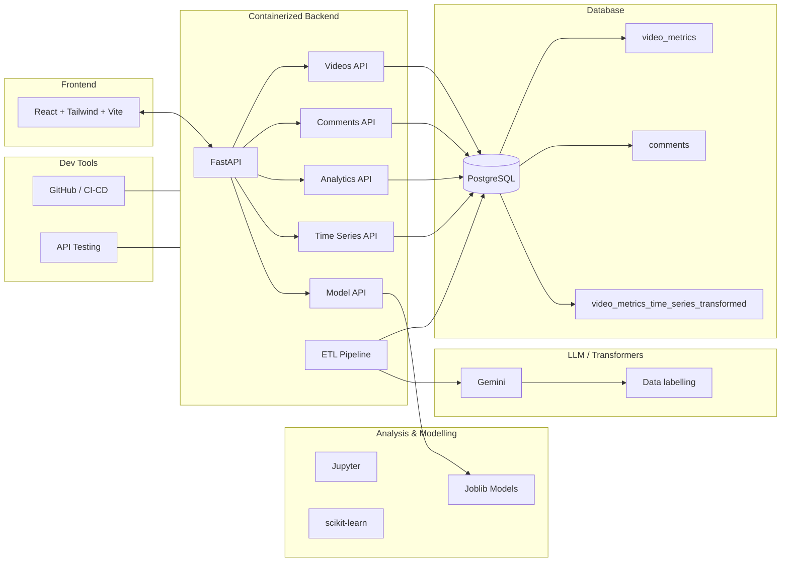

# FYP Backend

FastAPI backend for the final year project. The service ingests YouTube video and comment data, transforms it with an ETL pipeline, stores it in PostgreSQL, and exposes analytics and machine learning endpoints for a separate frontend.

## Architecture



## What This Project Does

- Pulls YouTube video metadata and top-level comments.
- Cleans and transforms raw data into analytics-ready tables.
- Serves dashboards, chart data, and per-video insights through FastAPI.
- Exposes ML prediction endpoints for sentiment classification.

## Tech Stack

- FastAPI
- Python
- PostgreSQL
- Supabase
- SQLAlchemy
- pandas, NumPy, scikit-learn
- Joblib for serialized vectorizers and classifiers
- Jupyter for experimentation and model development
- Docker for containerized deployment

## Project Structure

- `app/main.py` - FastAPI app entry point and router registration.
- `app/routers/` - API routes for videos, comments, analytics, time series, and ML models.
- `app/services/` - Business logic and dashboard queries.
- `app/etl/` - Extract, transform, and load pipeline for YouTube data.
- `app/database/` - Database connection helpers and table initialization scripts.
- `app/ml/` - Saved classifiers, vectorizers, and inference utilities.
- `app/models/` - SQLAlchemy models.
- `app/schemas/` - Pydantic request and filter schemas.

## API Overview

Base routes are mounted under `/api`.

- `GET /api/videos/get_video?url=...` - ingest a new video if it does not already exist.
- `GET /api/videos/{video_id}/overview` - video-level summary.
- `GET /api/videos/{video_id}/comments` - paginated comments for a video.
- `GET /api/videos/{video_id}/keywords` - top keywords for a video.
- `GET /api/videos/get_video_ids` - filtered video listing.
- `GET /api/comments/get_comments?video_id=...` - ingest comments for a video.
- `GET /api/analytics/overview` - dashboard KPIs.
- `GET /api/analytics/distribution/{column}` - grouped distributions.
- `GET /api/analytics/top-videos` - ranked videos by a selected metric.
- `GET /api/analytics/keywords` - keyword frequency data.
- `GET /api/analytics/comment-samples` - random comment samples.
- `GET /api/analytics/summary` - topic summary table.
- `GET /api/analytics/heatmap` - heatmap data.
- `GET /api/analytics/scatter` - scatter plot data.
- `GET /api/analytics/filter-options` - dashboard filter metadata.
- `GET /api/analytics/dashboard/kpi` - KPI dashboard data.
- `GET /api/analytics/dashboard/engagement` - engagement dashboard data.
- `GET /api/analytics/dashboard/sentiment` - sentiment dashboard data.
- `GET /api/timeseries/video-metrics` - time-series metrics.
- `GET /api/timeseries/aggregate/{group_by}` - grouped time-series aggregation.
- `POST /api/model/predict` - sentiment prediction for input text.
- `GET /api/model/overview` - model overview metadata.
- `GET /api/model/performance/{dataset}/{model}` - saved evaluation metrics.
- `GET /api/model/tuning/{model}` - tuning results for a model family.

## Data Flow

1. A user submits a YouTube URL through the backend or frontend.
2. The ETL layer fetches metadata and comments from the YouTube Data API.
3. Raw data is cleaned, enriched, and labelled.
4. Transformed rows are stored in PostgreSQL.
5. Analytics routes query the database and return chart-ready JSON.
6. The ML endpoint loads saved models and predicts sentiment for new text.

## Database Tables

- `video_metrics` - main video analytics table.
- `comments` - cleaned comment records with predicted sentiment labels.
- `video_metrics_time_series_transformed` - transformed dataset for time-series analysis.

## Environment Variables

Set these in your `.env` file:

- `DATABASE_URL` - async database URL for time-series queries.
- `DATABASE_URL_STATIC` - database URL used by the main API and static reads.
- `YOUTUBE_API_KEY` - YouTube Data API key.
- `GEMINI_API_KEY` - Gemini key used for topic labelling.

## Local Setup

1. Create and activate a Python virtual environment.
2. Install dependencies:

```bash
pip install -r requirements.txt
```

3. Create a `.env` file with the variables above.
4. Initialize the database tables using the scripts under `app/database/`.
5. Run the API:

```bash
uvicorn app.main:app --reload
```

The API will be available at `http://127.0.0.1:8000`.

## Docker

Build and run the backend container:

```bash
docker build -t fyp-backend .
docker run -p 8000:8000 --env-file .env 
```

## Frontend Integration

The backend is configured to allow requests from a local frontend running on `http://localhost:5173` and `http://127.0.0.1:5173`.

## Notes

- Topic classification is handled during the ETL pipeline using Gemini-assisted labelling.
- Comment sentiment is predicted using the saved model artifacts in `app/ml/`.
- Model files and vectorizers are stored as Joblib artifacts so the API can serve inference quickly.